# AirbnbClone-SwiftUI

## Overview
This project is a clone of Airbnb, built using SwiftUI for iOS. It demonstrates modern SwiftUI practices and architecture, creating a visually appealing and functional application similar to Airbnb.

## Features
- User authentication
- Browsing available rentals
- Viewing rental details
- Booking reservations
- User profile management


## Screenshots

<div style="display: flex; flex-direction: row; gap: 10px; flex-wrap: wrap;">
  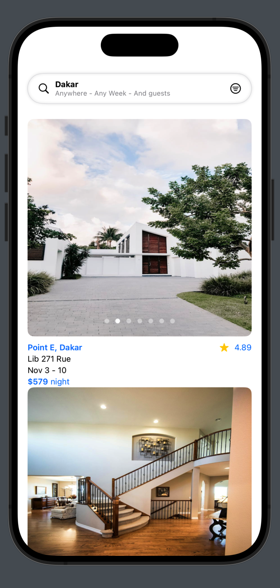
  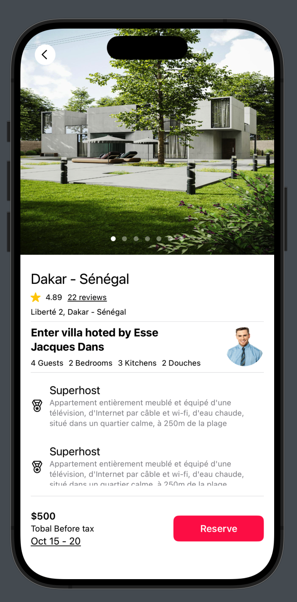
  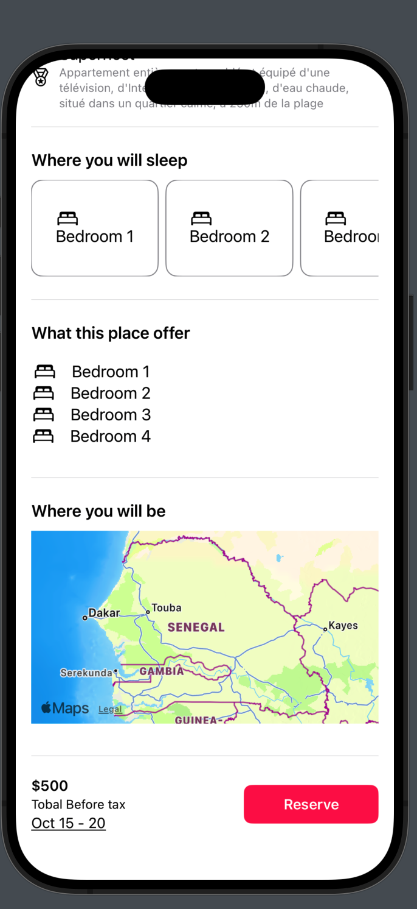
  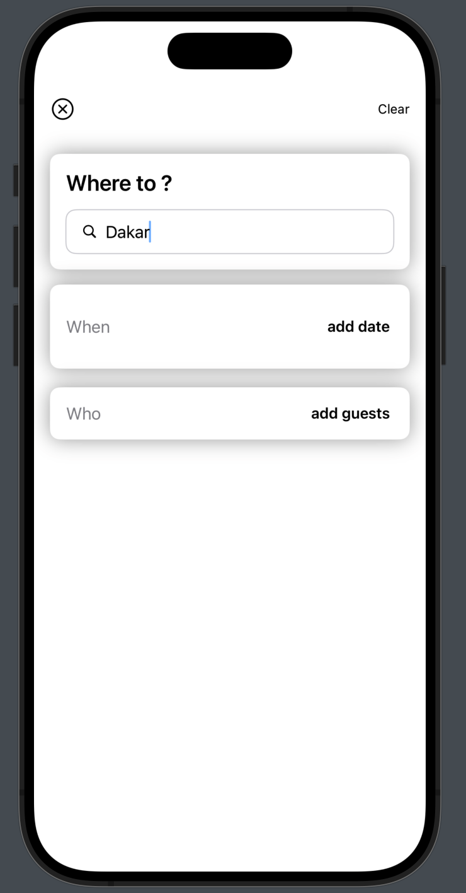
  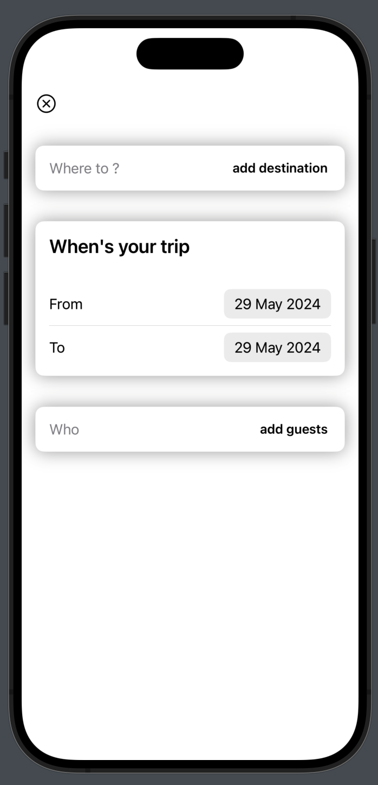
  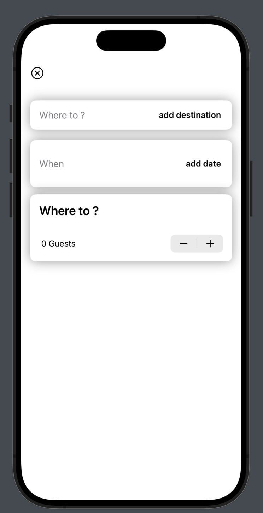
  
  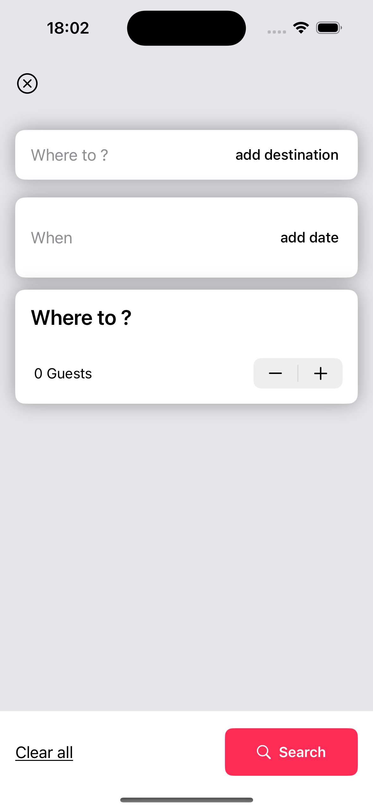
  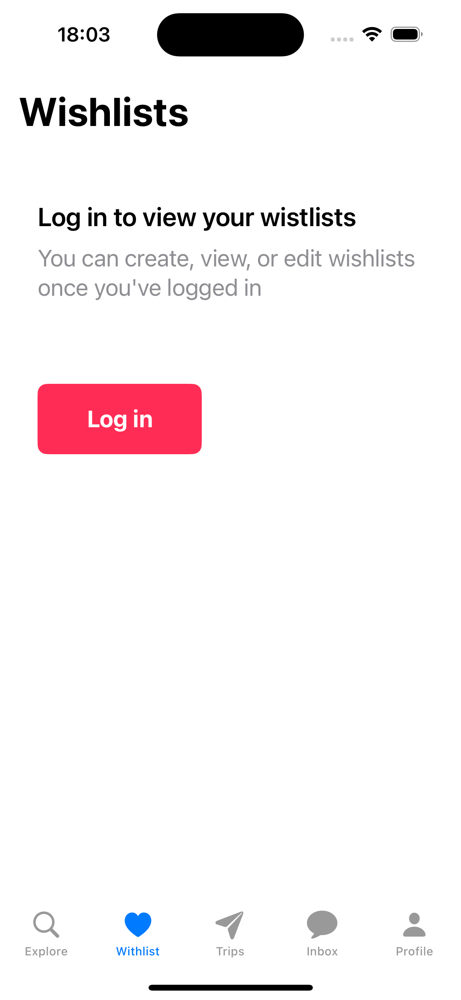
  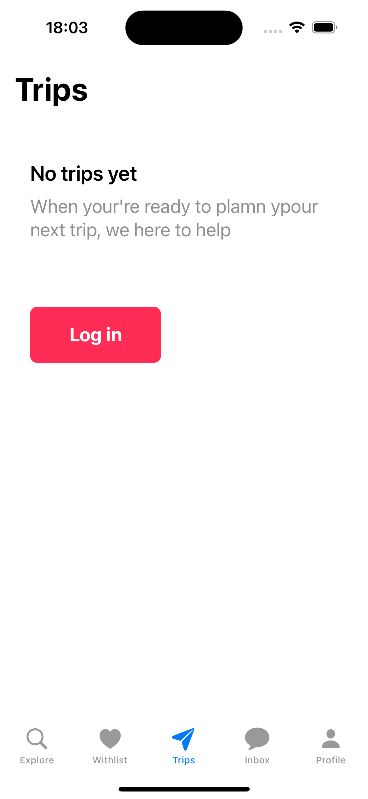
  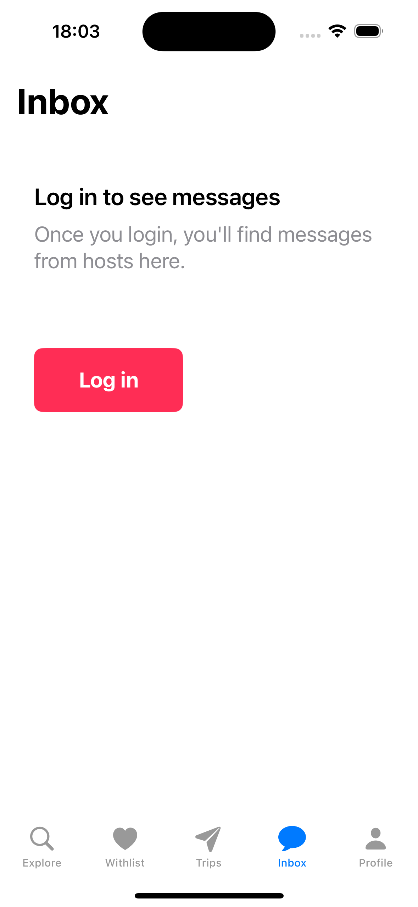
  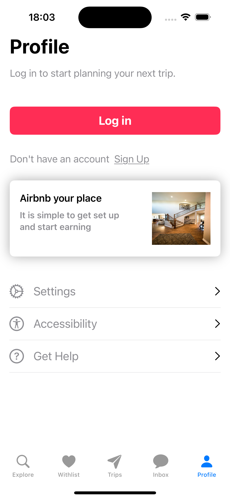
  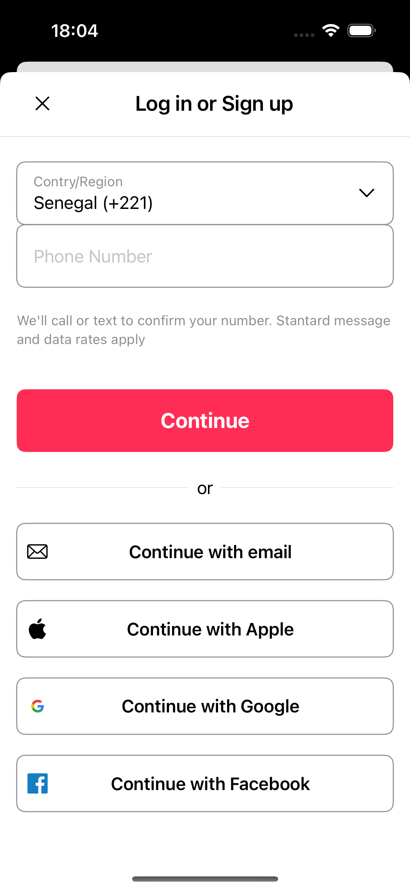
</div>


## Requirements
- iOS 14.0+
- Xcode 17.0+
- Swift 5.3+

## Installation
1. Clone the repository:
   ```sh
   git clone https://github.com/esse-jacques-dansomon/AirbnbClone-SwiftUI.git
   ```
2. Open the project in Xcode:
   ```sh
   cd AirbnbClone-SwiftUI
   open AirbnbClone.xcodeproj
   ```
3. Build and run the project using Xcode.

## Architecture

### App
- Main entry point of the application
- Handles app lifecycle events

### Core
- Business logic and data management
- Network requests, data persistence, and app state

### Features
- User Authentication
- Rental Browsing
- Booking System
- Profile Management

### Extensions
- SwiftUI View extensions
- Utility extensions for better code readability

### Utils
- Helper functions and constants


## Contributing
1. Fork the repository.
2. Create a new branch:
   ```sh
   git checkout -b feature-branch
   ```
3. Make your changes.
4. Commit your changes:
   ```sh
   git commit -m "Feature description"
   ```
5. Push to the branch:
   ```sh
   git push origin feature-branch
   ```
6. Open a pull request.

## License
This project is licensed under the MIT License.

## Contact
For any questions or suggestions, please open an issue on the repository.

## Acknowledgments
- Inspired by Airbnb
- Built using SwiftUI

For more details, visit the [repository](https://github.com/esse-jacques-dansomon/AirbnbClone-SwiftUI).
